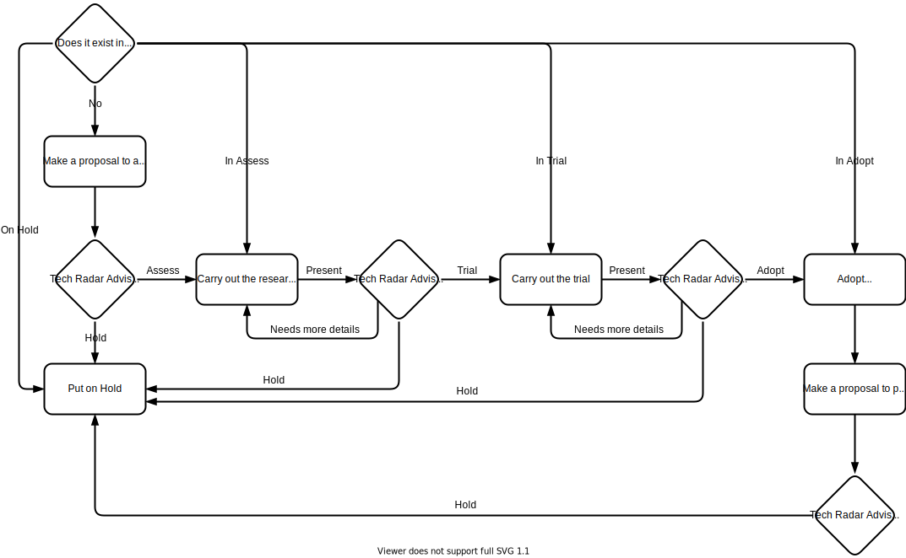

# [OVO.com Technology Radar](https://ovo-com-tech-radar.ovotech.org.uk)

[ovo-com-tech-radar.ovotech.org.uk](https://ovo-com-tech-radar.ovotech.org.uk)

The OVO.com Technology Radar is a living document that captures and provides a
high-level overview of our technology landscape.

The radar consists of four quadrants:

- **Techniques**  
  Includes various aspects of software development process and ways of working.
- **Languages & Frameworks**  
  Our main programming languages and key frameworks used for development.
- **Platforms**  
  Platforms that we use to build our software on top, e.g. databases, cloud
  services etc.
- **Tools**  
  Various software development tools that make our lives easier.

Each quadrant is divided into four rings:

- **Adopt**  
  Technologies we have high confidence in to serve our purpose, also in large
  scale. Technologies with a usage culture in our OVO production environment,
  low risk and recommended to be widely used.
- **Assess**  
  Technologies that are promising and have clear potential value-add for us;
  technologies worth investing research and proof of concept efforts in to see
  if they may add value. These technologies have higher risks; they are often
  brand new and highly unproven in our organisation. You will find some
  engineers that have knowledge in the technology and promote it, you may even
  find teams that have started a proof of concept effort.
- **Trial**  
  Technologies that we have seen work with success in project work to solve a
  real problem; first serious usage experience that confirm benefits and can
  uncover limitations. These technologies are slightly more risky; some
  engineers in our organisation have used them before and will share knowledge
  and experiences.
- **Hold**  
   Technologies not recommended to be used for new projects. Technologies that we
  think are not (yet) worth to (further) invest in. The technologies should not be
  used for new projects, however it might be acceptable to continue using the technology
  on an existing project.

## Why you should use the Radar

A consistent technology stack is often a big driver of delivery efficiency, cost
effectiveness and knowledge sharing across teams and the Technology Radar is an
important tool that helps us in discussions about the technologies that we want
to standardise on and invest in as an organisation.

## How to use the Radar

While consistency is the driving principle for our Radar, we also want to
encourage innovation, creativity and allow anyone to challenge our choices if
they believe there's a better way of doing something, which is why we put in
place the following process.

### Propose a new technology

To assess a new technology that is not listed on the Radar, please use our
[#ovo-com-tech](https://ovoenergy.slack.com/archives/C01QB298E59) Slack channel
to start a discussion and share your use case with others. To make the initial
case, you need to provide the following information:

- Why are you and your team interested in this technology, what value could it
  add to OVO?
- How does it compare to the adopted technologies, i.e. why would you want to
  use it over one of our currently adopted technologies?
- How are you planning to evaluate it, i.e. what will the research and PoC
  consist of?
- What are your success criteria?

A decision on whether you can proceed with the assessment and add the technology
to the Assess quadrant or whether it needs to be put on Hold will be made by HoE
with a recommendation from the Tech Radar Advisory Group[^1]. The proposal can
be reviewed by anyone, and any comments and feedback shared by our engineering
community will be taken into consideration.

### Present the research & PoC

You should evaluate your PoC against the success criteria defined in your
initial proposal and present the results of your research to the Tech Radar
Advisory Group. The group will form a recommendation to the HoE on whether the
technology can be promoted to the Trial quadrant, requires further evidence or
clarification to support your case, or should be put on Hold. In order to make a
case to promote the technology into Trial, please provide the details on:

- How the technology will be used to solve a real problem.
- How you’re planning to evaluate it and prove its value.
- What are the things you’d like to learn about it from the trial.

### Trial the technology

Trial is a first serious usage of the technology that can confirm its benefits
and can uncover any limitations. The technology should be used to solve a real
problem as per the above proposal, can be used in production with caution and
risk mitigation measures in place, but must not be used for mission-critical
systems.

If you trial a technology, you must present the progress and results to the Tech
Radar Advisory Group on a quarterly basis, which will determine whether the
technology can be promoted to the Adopt quadrant, needs more evidence and
further evaluation (and therefore needs to remain in Trial) or should be put on
Hold going forwards. In case the technology is put on hold, you might be
required to migrate to one of the adopted technologies instead, however, in some
circumstances it might be acceptable to continue using the technology for your
particular use case without adopting it organisation-wide - this will be
considered on case by case basis.

### Re-evaluate if appropriate

A proposal to re-evaluate any existing technology being on Hold can be made at
any time to resume the process from the point it was decided to put that
technology on Hold. The proposal should be supported by any evidence that makes
the decision to put the technology on Hold no longer relevant, e.g. the
technology has matured enough, and the main concerns have been addressed since
it was last reviewed. The proposal will be reviewed, and a decision will be made
by the HoE after considering the recommendation from the Tech Radar Advisory
Group on whether the process can be resumed or the technology should remain on
Hold.

See the following flowchart for a summary of the process:

[Source](https://drive.google.com/file/d/1dPTx3ElrchkRw7iBxsNSReP35Sn68iVc/view?usp=sharing)
(for making comments or suggesting any changes)

### Responsibility boundaries

- HoE - executive decision maker, accountable for technology across the area
- Tech Radar Advisory Group - reviews changes to the Tech Radar and forms a
  recommendation to the HoE
- Tech Leadership Team - owners of the Tech Radar, including S5 engineers who
  drive technology discussions and ensure consistent approach across the area
- SEMs & S4 Engineers - responsible for ensuring tech consistency with the Tech
  Radar on a team-level

## FAQs

### Why is there only the Adopt ring on the Radar?

We've initially created the Radar only with technologies in the Adopt ring to
emphasize the focus on technologies which are already widely adopted and used in
production at OVO.com, but we will expand it to other rings in the future.

### What to do if a technology I want to trial is not listed here?

To assess or trial a new technology that's not listed on the Radar, please use
our [#ovo-com-tech](https://ovoenergy.slack.com/archives/C01QB298E59) Slack
channel to start a discussion and share your use case with others. See the
[process](#propose-a-new-technology) above.

### What to do if the technology I want to use is listed in the Adopt ring?

You should feel free to adopt the technology on your project, but we encourage
everyone to reach out to our engineering community on Slack in on
[#ovo-com-tech](https://ovoenergy.slack.com/archives/C01QB298E59) channel to
validate their design, find out more about how the technology is currently used
and get some general advice from others.

## Contributing

The OVO.com Technology Radar is owned by the OVO.com Tech Leadership, however
anyone from our engineering community can:

- fork & raise pull requests for additions, clarifications, grammar fixes,
  formatting changes and any other suggestions; any movements between quadrants
  or additions should follow the [process](#propose-a-new-technology) outlined
  above
- raise GitHub issues with any questions or improvements that might not be
  appropriate for a pull request
- create a new proposal, review and comment on pull requests and any proposals
  submitted by others

For any external contributions, please raise an issue or get in touch with us
via our [ovotech/general](https://gitter.im/ovotech/general) channel on Gitter.

[^1]:
    OVO.com Tech Radar Advisory Group - a group which is formed by the OVO.com
    Tech Leadership Team and Senior Engineers (S4+). The group meets on an as
    and when required basis to review any proposed changes to the Tech Radar,
    (i.e. movements between quadrants) and forms a recommendation to the HoE who
    has the final decision on any changes to the Tech Radar. The group should
    meet no more often than once per month to review any proposals.
